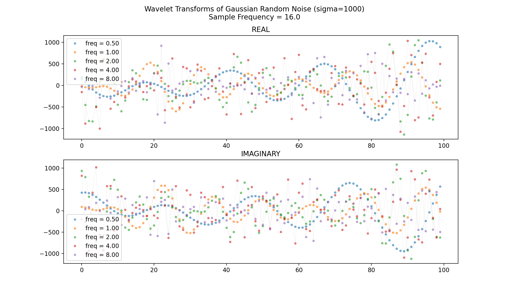
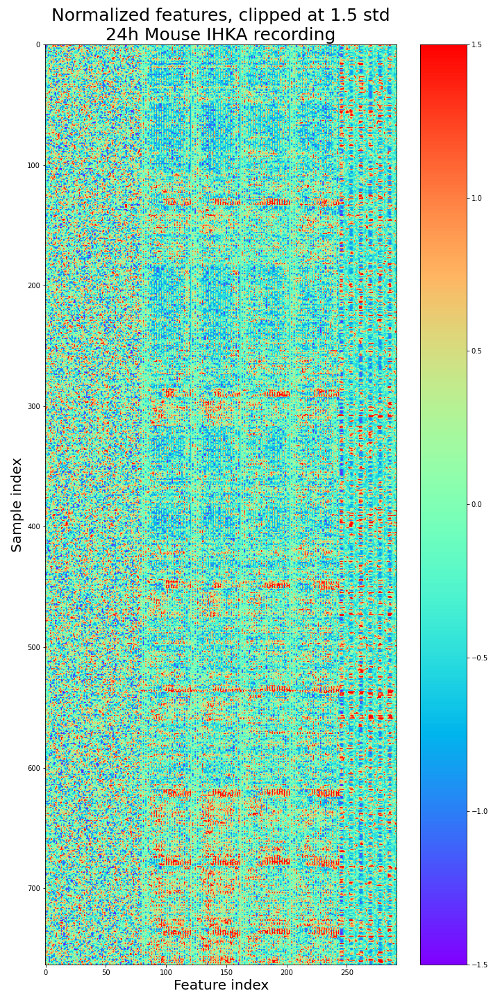
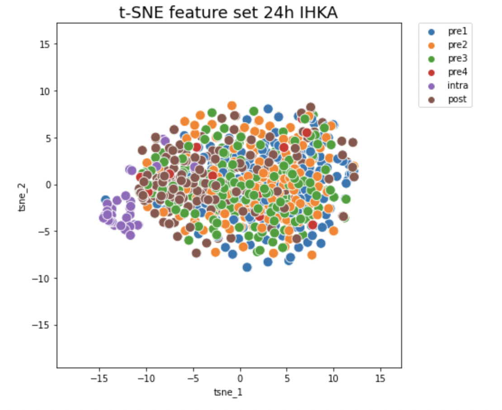
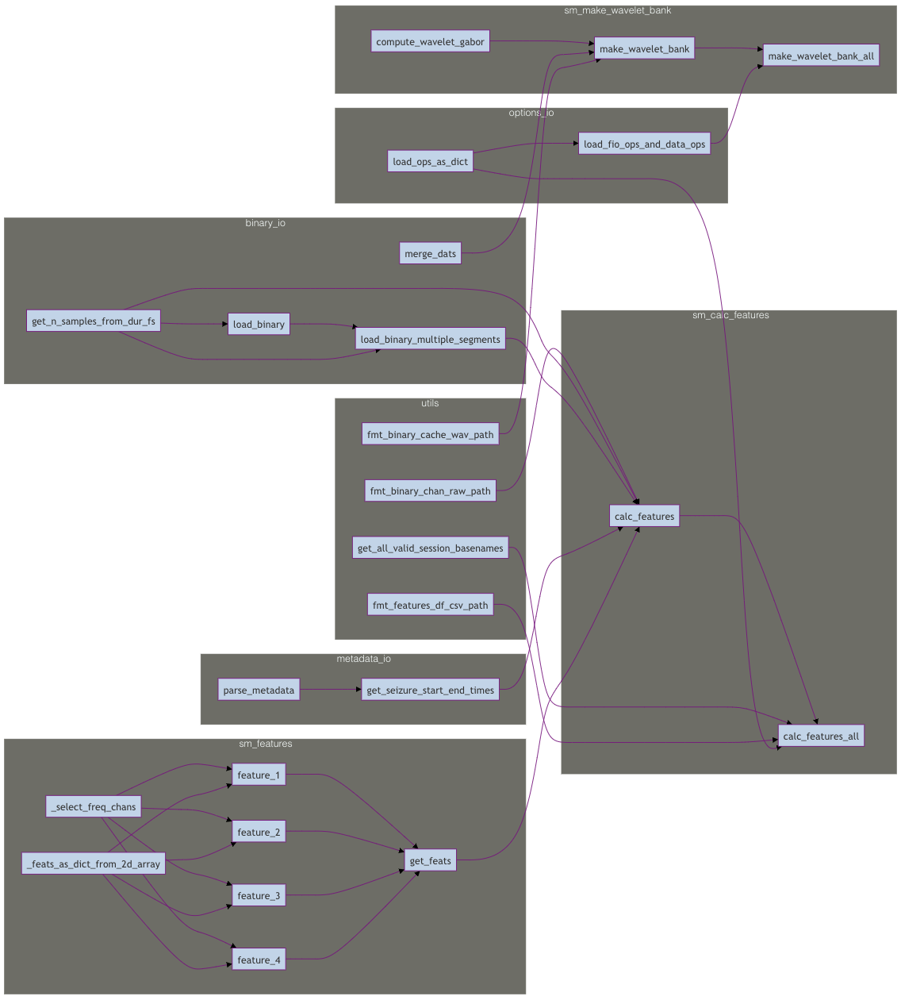

# IHKA python
IntraHippocampal Kainic Acid

Python modules for ihka data analysis, based off of MatLab code from [McKenzieLab's repository](https://github.com/McKenzieNeuro/McKenzieLab/tree/main/IHKA).

We have opted for a procedural programming approach rather than OOP because this project grew of a [MatLab project](https://github.com/McKenzieNeuro/McKenzieLab/tree/main/IHKA). This will ensure that the codebases have a similar feel which will help to curb the learning curve for those comming to the code form a matlab background.

## Install & Setup 
To access the methods and their modules, clone this repo with `git clone https://github.com/dcxSt/IHKApy`, enter it's root directory `cd IHKApy`, then pip install with `pip install .`

## Dependencies
- numpy
- scipy
  - scipy.io (only used in tests to read matlab files)
  - scipy.stats (for zscore-ing)
- pyedflib 
- contextlib
- pandas
- toml
- tqmd (for progress bar)
- re (regex library for tests and asserts, make sure verything formated well)

## Processing the RAW data
The submodule `sm_make_wavelet_bank` is comprised of a pure function (`compute_wavelet_gabor`) to compute the wavelet transform of our signals. 

## Features 
The following is a visualisation of an example feature set, computed for a 24h mouse IHKA recording firth 4 electrodes. Three sets of features are computed: 
(1) The mean power of each frequency channel, these are the leftmost columns that look like noise. 
(2) The variance, these are the four central column patterns, we can easily spot the the seizures here. 
(3) The coherence between each pair of channels at logarithmically sampled frequencies. Note the six right-most column-patterns (4 choose 2 = 6)

To add a feature, add the feature function in `sm_features.py`, then call that function in the body of `calc_features()` which can be found in `sm_calc_features.py`. 

This the output of `calc_feats` in the `sm_calc_feats` submodule.

Below: t-SNE clustering of the same feature-set. As you can see, it's hard to distinguish between pre-ictal classes. The pre-ictal classes correspond to 3h-1h, 1h-10min, 10min-10s, 10s-0s respectively, before a seizure. 

## Code

Overview of the pipeline.

  
Module dependency graph.

Function dependency graph.

## TODO
*This list is ordered from highest to lowest priority.*
- [x] Implement Options.toml config file as user input interface
- [x] Implement wavelet transform module, for turning raw edf into 
  - [x] Implement tests
  - [x] Test compare output with matlab scripts
    - [ ] also, implement this test in the test suite? (not a priority, but should be done eventually)
  - [x] Implement and test `make_all` method
- [x] Implement file I/O for reading from binary files
  - [x] Implement reading multiple segments at once
  - [x] Bullet proof with tests
  - [x] Test compare output with matlab scripts
- [x] Figure out how to connect to Azure blob storage via the API
- [x] features module 
- [x] Implement featurizing module
  - [x] Tim selection algorithm
- [ ] Robust test suit for fileio 
- [ ] Implement train model, (see jupyter notebook)
- [x] Generate docs
  - [x] ship docs
- [ ] Create a pip .env file for the dependencies, and verify with virtual environment 
- [x] Draw dependency graph
- [x] Detailed sketch of pipeline 
- [ ] Remove training parameters from Options.toml
- [ ] Organized & streamline testing pipeline
- [ ] Add instructions in this README for how to add features, which files should be changed etc.
- [ ] Jupyter notebook examples of training, perhaps in seperate repository?

- [ ] Little todos, formatting tasks
  - [ ] rename data ops FREQ_NUM etc. instead of what, add "FREQ" to SPACING param too
- [ ] Change `fileio` the dictionary to `fio_ops` because it's ambiguous and can eaily get confused with the module by the same name. Change this everywhere in the codebase including the `Options.toml`. *[I think this is mostly done... check this]*
- [ ] Think about features df size, so far, a single dataframe with three features on 2 raw channels and 41 freq channels (includes coherence which makes one feature for each pair of electrodes, 6) is 1.7M as a pkl. Think about either compressing it or serializing it more intelligently. 1.7M is okay but if we have a human with ~50 raw channels (so n\*(n-1)/2 is about 12000), we'll have much much more data. If we have more features we'll have *even more*, so we can expect that number to be 100 to 10000 times bigger for a full feature set on human data (i.e. data with more electrodes. Not good.) That will make them on the order of 0.1GB to 10GB. We probably need to think of a way to do this more efficiently... perhaps we need a module that serializes and unserializes pandas dataframes as int16 binaries so that we don't have to put all that data into memory. 
- [ ] Make sure precision isn't hard coded anywhere, get it from ops "int16"
- [ ] Do a consistency check of variable names

*Questions / Concerns*
- [ ] The raw data that gets serialized is not rescaled before it is cast into int16, in the case of the mouse data this causes non-negligible quantization because the RMS is around 12 (11.861 for the first channel), most of samples are in the single and low double digits. They could probably benefit from being scaled by a similar scale factor as the power and phase convolutions. 

*Discussion*
Although Pynapple's abstractions are very nice, they're not exactly what we want. If we wanted to make use of the interval restrict functionality, we would have to load large chunks of data (13GB) into RAM just to sample a small fraction of it. Instead, we implement methods to read small specific windows of binary files at a time. We could load those windows into a pynapple Tsd object, but I think this will not be necessary; it would be like using a sledgehammer to insert a pin into a corkboard. The only place something like the Interval Sets object might be handy is when defining those windows which to sample, but here I think the same can be accomplished with either an array or a pandas data frame. 

There is an intuitive but rigorous naming convention for binary files: each file  must match `${basename}_ch_\d\d\d.dat` where the three digits are the zero-padded index of the channel, and basename must match the `.edf` data file and the `.txt` metadata (seizure timestamps) file. 

## Docs

Documentation is available [here]().

To generate the docs locally install pdoc: `pip install pdoc`, then go into the project root directory and either
- run `pdoc ihkapy --host localhost`, to host and view the docs locally
- or create a docs directory `mkdir path/to/docs/dir` and generate the docs with `pdoc -o path/to/docs/dir ihkapy`

## Technical notes and comments
Currently we sample wavelet frequencies from a log space spanning 0.5 Hz to 200 Hz; our data's sampling frequency is 2000 Hz. 

Under the hood, scipy's coherence function (and mscohere) computes the mean of the square of the cross spectral density divided by the psd of each signal, and averages over as many 256-sample windows that it can fit into our 5-second long segment (=10000 samples). The smallest frequency it samples is only half a wavelength, the second smallest is a full wavelength. These low frequencies (the lowest of which is about 7Hz) are already much greater than our low wavelet frequencies.  

## Conventions
- The `edf` raw data file and it's `txt` metadata file must have the same basename and both be located in the `RAW_DATA_PATH` directory. 

## Expo

Displayed below is a 100-datapoint chunk of the output of `sm_make_wavelet_bank.compute_wavelet_gabor(signal,fs,freqs,xi)` where `signal` is a sample of random gaussian noise with the standard deviation set to 1000 i.e. `signal=np.random.normal(0,1000,500)`, `fs=16.0`, `freqs=[0.5,1,2,4,8]`, and `xi=5`. 

### Refs
- Article on IHKA [https://www.sciencedirect.com/science/article/abs/pii/S001448862030323X](https://www.sciencedirect.com/science/article/abs/pii/S001448862030323X) 
- Writing good pythonic python: [PEP8](https://pep8.org/#break-before-or-after-binary-operator)
- [Guide to python packaging (the docs)](https://python-packaging.readthedocs.io/en/latest/dependencies.html)
- Classification / training links
  - [imbalanced ensemble training python tutorial](https://imbalanced-ensemble.readthedocs.io/en/latest/auto_examples/basic/plot_basic_example.html) 

